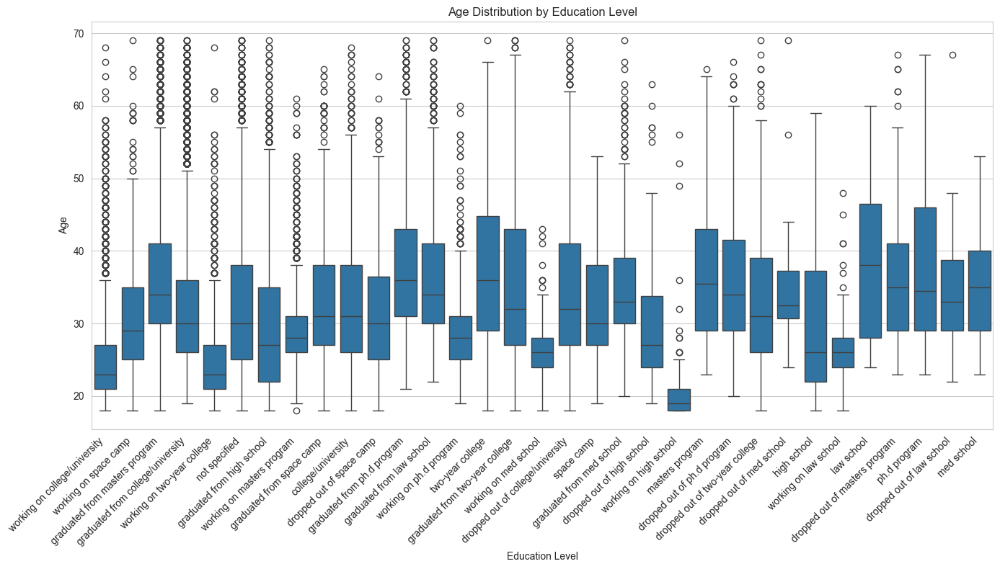
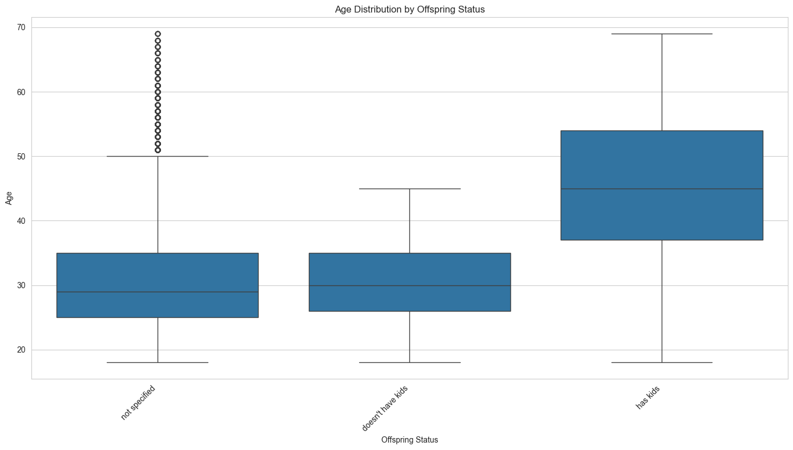
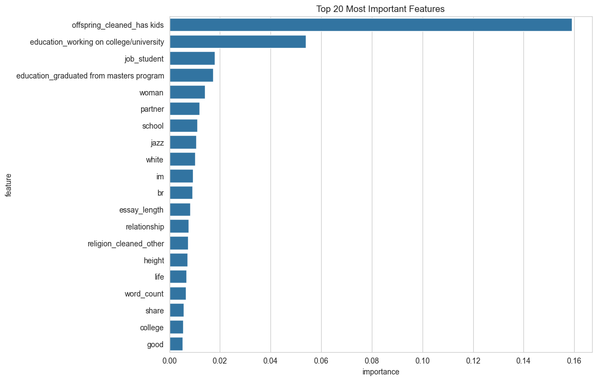

# Predicting User Age on OKCupid

## 1. Introduction & Project Goal

This project uses a dataset of OKCupid user profiles to predict a user's age based on the information they provide. The goal was to go through the complete machine learning pipeline: data cleaning, exploratory data analysis (EDA), extensive feature engineering, and finally, model training and evaluation. The dataset was provided by Codecademy and contains profile information for ~60,000 users.

### Data

The dataset used in this analysis is the "OKCupid Profile Data for Intro Data Science Projects" originally published on GitHub and widely used in data science tutorials.

Due to its size, the dataset (`profiles.csv`) is not included in this repository. You can download it directly from its source on [Kaggle](https://www.kaggle.com/datasets/andrewmvd/okcupid-profiles) or the [original Codecademy repo](https://github.com/Codecademy/OKCupid-Date-A-Scientist).

## To run this project, please download the `profiles.csv` file and place it in the project's root directory.

## 2. Data Cleaning & Exploratory Analysis (EDA)

The initial phase focused on cleaning the raw data and understanding the relationships between different variables and our target, `age`.

### Initial Cleaning

- **Missing Values:** Handled `NaN` values across numerous columns by either imputing a placeholder like `"not specified"` for categorical data or filling with an empty string for the essays.
- **Outlier Removal:** The initial age distribution showed clear outliers (e.g., users aged over 100). To create a more realistic dataset for modeling, profiles with an age greater than 65 were filtered out.

### Exploratory Analysis

Analysis revealed that the strongest predictors of age were features related to a user's life stage.

- **Education:** A user's education level showed a clear correlation with age. For example, users "working on" a degree were consistently younger than those who had "graduated from" the same program.
  

- **Offspring:** Similarly, a user's parental status was a dominant predictor. Users who "have kids" were significantly older than those who "don't have kids."
  

---

## 3. Feature Engineering

This was the most critical phase of the project, where raw data was transformed into numerical features suitable for a machine learning model.

- **Categorical Features:** Simplified messy columns like `religion` and `sign` by extracting the core category (e.g., `"gemini"` from `"gemini and it doesn't matter"`).
- **Location & Datetime:** Engineered the `location` string to extract the `state`, and converted `last_online` strings into `year`, `month`, and `dayofweek` features.
- **Multi-Label Features:** Handled columns like `ethnicity` and `speaks`, where a user could list multiple values, by creating binary dummy columns for each possible entry (e.g., `asian`, `white`, `english`, `spanish`).
- **One-Hot Encoding:** Converted all final categorical features into a numerical format using one-hot encoding.
- **Text Features (NLP):**
  - Combined all 10 essay columns into a single text block for each user.
  - Created simple metrics like total character count and word count.
  - Used **TF-IDF (Term Frequency-Inverse Document Frequency)** on the combined essays to convert the text into a 500-column numerical matrix, capturing the most important words.

---

## 4. Modeling & Evaluation

Two different regression models were trained to predict age, and their performance was compared.

1.  **Ridge Regression:** A robust linear model that performs well with a large number of features.
2.  **Random Forest Regressor:** A more complex, tree-based model capable of learning non-linear patterns.

### Results

Interestingly, the simpler Ridge model outperformed the more complex Random Forest. This is likely because the high number of sparse features created during feature engineering was handled more effectively by the Ridge model's regularization.

| Metric                        | Ridge Regression (Final Model) | Random Forest |
| :---------------------------- | :----------------------------- | :------------ |
| **R-squared (R²)**            | 0.52                           | 0.44          |
| **Mean Absolute Error (MAE)** | 4.84 years                     | 5.11 years    |

### Feature Importance

An analysis of the Random Forest model revealed which features it found most predictive. This confirmed our EDA findings, with `images/offspring_cleaned_has kids` being the single most important feature.

---

## 5. Conclusion

This project successfully developed a model capable of predicting a user's age with a **mean absolute error of ~4.8 years**. The key takeaway is that a user's life stage—primarily their parental and educational status—provides the most significant signal for predicting their age. This project demonstrates a complete, end-to-end data science workflow, from data cleaning and exploration to feature engineering and final model evaluation.

**[Live Demo](https://codecademy-okcupid-project.onrender.com)** | **[View Presentation](https://docs.google.com/presentation/d/1fEvDoQaLvLCqVnlATZuFn5qokbQzninTDeZ5GN3q8So/edit?usp=sharing)**

